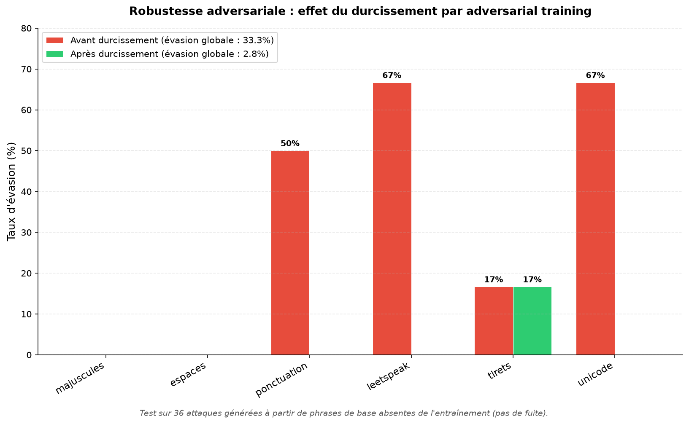

# 🛡️ LLM Injection Detector

**Middleware de détection de prompt injection et jailbreak en temps réel pour applications LLM.**

*Read this in [English](README.md).*

<!-- Une fois ton Space HuggingFace en ligne, remplace l'URL ci-dessous -->
[](https://huggingface.co/spaces/TON_PSEUDO/TON_SPACE)


La prompt injection est classée **n°1 du OWASP Top 10 for LLM Applications (2025, LLM01)**.
Ce projet construit un middleware défensif qui s'intercale entre l'utilisateur et le LLM
et classe chaque entrée comme bénigne ou malveillante en temps réel — à la manière d'un
WAF, mais pour les LLM.

---

## 📊 Résultat clé : durcissement adversarial

L'adversarial training a fait chuter le taux d'évasion sur des attaques obfusquées
**jamais vues** de **33,3 % à 2,8 %** — une amélioration de 30 points — en ajoutant
seulement 48 exemples adversariaux (1,5 % du dataset).



*Testé sur 36 attaques générées à partir de phrases de base absentes de l'entraînement (pas de fuite).*

---

## Résultats en un coup d'œil

| Métrique | Valeur |
|----------|--------|
| F1 de détection (modèle durci) | 0,97 |
| Taux d'évasion — avant durcissement | 33,3 % |
| Taux d'évasion — après durcissement | **2,8 %** |
| Exemples adversariaux ajoutés | 48 (1,5 % du dataset) |
| Non-régression sur entrées légitimes | 6/6 ✅ |

### Cartographie de robustesse (3 surfaces d'attaque)

| Catégorie d'attaque | Taux d'évasion | Faiblesse réelle |
|---------------------|----------------|------------------|
| Obfuscation (surface) | 28,6 % | La plus vulnérable — corrigée par durcissement |
| Sémantique (sens) | 14,3 % | Robuste : les embeddings capturent l'intention |
| Multilingue | 12,5 % | Fragile sur les écritures non-latines |

---

## Comment ça marche

Le middleware intercepte chaque message, le passe au détecteur, et soit le bloque,
soit le transmet au LLM :

```
message utilisateur
      │
      ▼
[ détecteur ]  ──malveillant ?──►  OUI  →  bloque, renvoie un refus
      │
      NON
      │
      ▼
[ LLM ]  →  renvoie la réponse
```

**Pipeline :** texte → embeddings de phrases (`all-MiniLM-L6-v2`) → classifieur
par régression logistique → verdict + score de confiance.

---

## Démarrage rapide

```bash
# 1. Cloner et installer
git clone https://github.com/TON_PSEUDO/llm-injection-detector.git
cd llm-injection-detector
python3 -m venv .venv && source .venv/bin/activate
pip install -r requirements.txt

# 2. Lancer la démo interactive (compare v2 vs v3 côte à côte)
python demo.py

# 3. Ou lancer l'API
uvicorn app.main:app --reload
# Documentation interactive sur http://127.0.0.1:8000/docs
```

### Points d'entrée de l'API

| Endpoint | Description |
|----------|-------------|
| `POST /detect` | Analyse un texte → verdict (bénin/malveillant) + confiance |
| `POST /chat` | Middleware complet : détecte, puis bloque ou transmet au LLM |

---

## Démarche du projet

Construit en cinq phases, chacune se terminant par un livrable concret :

1. **Dataset** — 3 120 exemples unifiés et équilibrés depuis 3 sources publiques hétérogènes.
2. **Détecteur baseline** — embeddings + classifieur ; diagnostic et correction d'un biais de registre (F1 0,95 → 0,97).
3. **Middleware** — service FastAPI avec détection, logique de décision et logging.
4. **Robustesse adversariale** — cartographie des attaques + durcissement par adversarial training (évasion 33,3 % → 2,8 %).
5. **Packaging** — démo interactive, benchmark, documentation.

---

## Limites connues

Honnête sur ce que le projet ne résout *pas* :

- **Couverture multilingue inégale** — les écritures latines sont bien gérées ; les écritures non-latines (arabe, et chinois à faible confiance) restent fragiles. Un modèle d'embedding multilingue serait la solution.
- **La « zone grise » de confiance** — les formulations très polies/indirectes peuvent faire tendre la confiance vers 0,5. Une réponse graduée (autoriser / signaler / bloquer) gérerait mieux ce cas qu'un seuil binaire.
- **Le durcissement adversarial est une cible mouvante** — il neutralise les techniques d'obfuscation connues, mais de nouvelles peuvent être conçues. Il élève le coût de l'attaque ; il ne la « résout » pas.

---

## Stack technique

Python · HuggingFace Sentence Transformers · scikit-learn · FastAPI · Gradio

## Licence

MIT